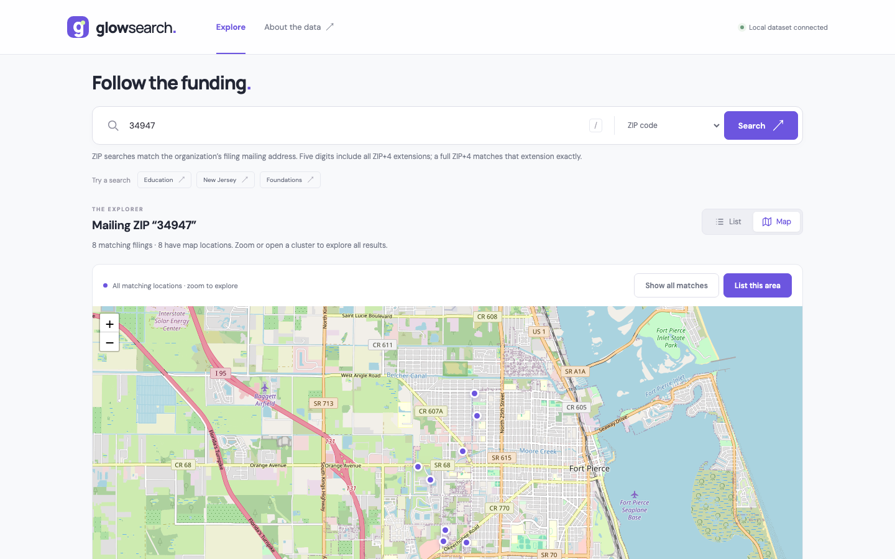
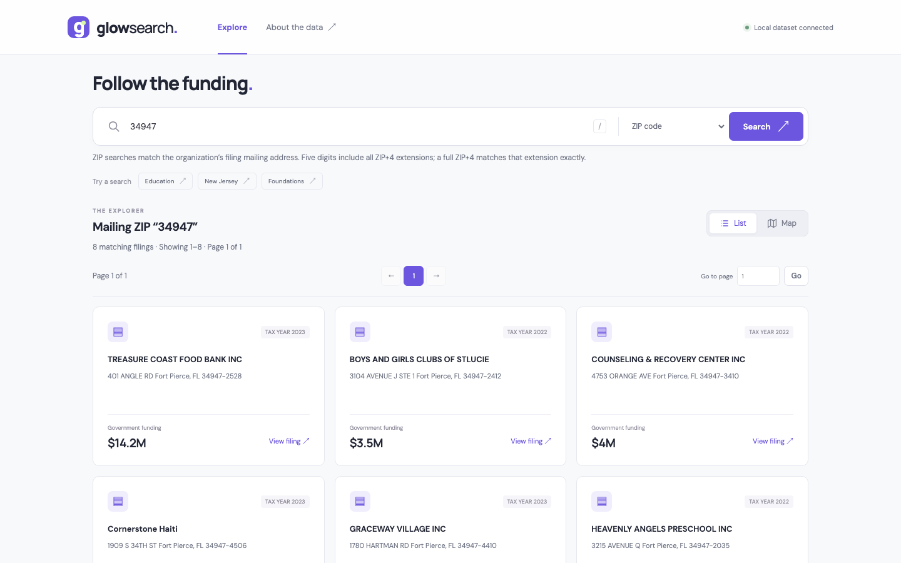
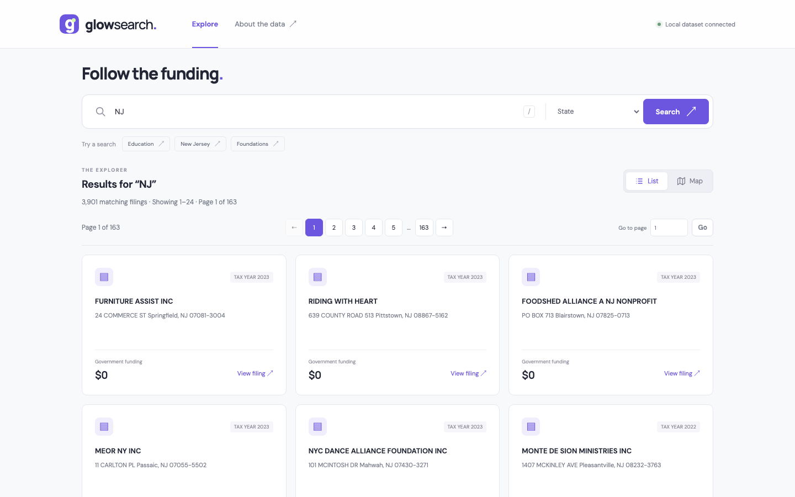

# GlowSearch — Follow the Funding


**Explore 166,385 nonprofit filings, reported government funding, officers, and locations — on a fast clustered map.** A Flask app with a responsive search interface over a local SQLite dataset.

## The mission

Federal grants move billions of taxpayer dollars through nonprofits every year, and the public record of who receives that money — and where it actually goes — is scattered, hard to search, and harder to map. GlowSearch exists to change that.

This project is built in support of the **DOGE (Department of Government Efficiency)** mission championed by **Elon Musk**: radical transparency into government spending. If grant funds are being laundered through layers of related corporations, shell entities, or misdirected addresses, the trail is in the filings. GlowSearch makes that trail searchable — by name, officer, EIN, ZIP code, or state — and visible on a map, so anyone can follow the funding.

## Screenshots

| Search | Map |
| --- | --- |
|  |  |
|  |  |

Mobile layout: [docs/screenshots/mobile.png](docs/screenshots/mobile.png)

## Download the dataset

The code is here on GitHub; the database ships separately:

```bash
git clone https://github.com/valinux/Federal-grant-search.git
cd Federal-grant-search
```

Download **[GlowSearch-Database-2026-09.zip](https://drive.google.com/file/d/1GfLJG84hwEdsmM01ovPHuNlCAL_MgTWX/view?usp=sharing)** (90 MB) and extract it into the project folder. It contains:

- `output_two.db` — the full 166,385-filing database
- `output_two.locations.json` — the audited location corrections overlay (without it the app runs, but maps show the original unverified coordinates)

Then:

```bash
python3 -m venv .venv
source .venv/bin/activate
python -m pip install -r requirements.txt
python build_index.py   # optional but recommended; about two minutes
python flaskserver1.py
```

Open **http://127.0.0.1:8080**.

The same files are also on the [dataset release](https://github.com/valinux/Federal-grant-search/releases/tag/dataset-v1), including the optional prebuilt search index.

## Run locally

Requires Python 3.10+ with SQLite JSON functions. The optional search index requires SQLite 3.34+ with FTS5 and its trigram tokenizer. The application has been tested with Python 3.14 and SQLite 3.50.

```bash
python3 -m venv .venv
source .venv/bin/activate
python -m pip install -r requirements.txt
```

Place `output_two.db` in the project folder. It must contain a `filings` table with `filer_ein` and `filer_name`. The original dataset also includes financial amounts, addresses, officers, and `geo_loc` coordinates. The database is distributed separately and is excluded from Git.

Build the search index once for faster substring searches:

```bash
python build_index.py
python flaskserver1.py
```

Open **http://127.0.0.1:8080**. If that port is occupied:

```bash
PORT=8081 python flaskserver1.py
```

For a database stored elsewhere:

```bash
export GLOWSEARCH_DB=/absolute/path/to/output_two.db
python build_index.py
python flaskserver1.py
```

The app reads the original database without modifying it. `build_index.py` streams records into a separate `output_two.search.db`, then replaces that cache atomically. Re-run the command whenever you replace or update the source database. A missing or stale index falls back to direct SQLite searches. With the supplied 166,385-record dataset, the index takes about two minutes to build and uses approximately 600 MB of additional disk space; timings and size depend on the machine and dataset.

## Explore

- Search by organization, officer, founder, EIN, phone, address, ZIP code, state, or description. EINs and phone numbers accept common formatting. Search text treats `%` and `_` literally.
- **ZIP code** searches match the postal code in the organization's filing mailing address exactly. A five-digit ZIP includes its ZIP+4 extensions; a full ZIP+4 matches only that extension. Leading zeros are preserved, and ZIP+4 accepts a hyphen, space, or nine digits. Street numbers, EINs, phone numbers, and related organizations' addresses cannot create ZIP matches. List totals, maps, and map-area filters use the same rule. **All fields** remains a broad text search; choose **ZIP code** for location matching.
- **State** searches match the two-letter code in the mailing address's postal position exactly. Lookalike address text such as `", FLOOR 2"`, street numbers, and unparseable trailing countries cannot create state matches, and codes that are not U.S. states or territories are rejected.
- Switch between List and Map while retaining your query. Search URLs can be bookmarked, and browser Back/Forward restores searches.
- List results show **24 filings per page**, the exact total matching count, and **Page X of Y**. Numbered navigation and a **Go to page** input appear above and below the results. Any page, including the last page, can be opened directly and bookmarked. Filings from different years remain separate records.
- Open **View filing** for amounts, officers, related organizations, and original source links. Full details are fetched only when opened. Officer lists are limited to 100 entries, with a link to the original source when available.
- Maps represent **every matching filing with valid coordinates**. The server groups all points into at most 512 visual markers/clusters per response; there is no filing-count cutoff. Cluster counts include all their records. Zooming or panning refreshes the visible clusters automatically. Click a cluster and choose **Zoom in** or **View these filings** to open the complete numbered list for that cluster, including filings at identical coordinates. **List this area** opens all results in the current map view, and **Show all matches** restores the full map. Records without usable coordinates remain available in the regular list, with their count reported on the map.
- Press `/` to focus search. The map does not capture page scrolling. The layout supports desktop and mobile screens.

The first request finds all matching IDs so totals and page navigation are accurate. Bounded caches retain compact ID and coordinate arrays; full filing rows are fetched only for the requested page or individual marker. Query caches invalidate when the source database, index, or location corrections change. Map responses contain small aggregate clusters, not thousands of filing payloads. Database operations have a fifteen-second execution budget. Very short searches and unindexed searches can take longer to count initially; subsequent page and map requests reuse the cached results.

Leaflet 1.9.4 is served locally from `static/vendor`, with its license included there. Clustering happens on the server. Map tiles come from OpenStreetMap and require internet access. Fonts have local system fallbacks. Folium and its generated HTML maps are no longer required.

## Location accuracy: four audited passes

Following the money only works if the map is truthful. The source dataset contained thousands of misplaced, missing, or fabricated coordinates, so every located filing has now been through four audit passes. Corrections are saved in `output_two.locations.json` next to the source database — the original database is never modified. Each correction retains the original EIN, address, and coordinates and is applied only while all three still match the original record. Preserve `output_two.locations.json` alongside your database when moving the app to another computer.

**1. Brazil cluster repair (`repair_locations.py`).** The supplied database included 822 filings with U.S. mailing addresses but coordinates in or near Brazil: 430 repaired with street-address estimates from the [U.S. Census geocoder](https://geocoding.geo.census.gov/geocoder/Geocoding_Services_API.html) (validating building number, state, and ZIP), 392 with explicitly labeled postal-area estimates from [GeoNames](https://download.geonames.org/export/zip/) ([CC BY 4.0](https://creativecommons.org/licenses/by/4.0/)). Two unusual addresses were checked against the organizations' own websites ([Red River Community House](https://www.redrivercommunityhouse.com/), [Transatlantic Council](https://tacscouting.org/about/contact-us-2/)).

**2. Nationwide state audit (`repair_nationwide.py`).** Every filing's coordinates were compared with its mailing state using the Census Bureau's 2025 state cartographic boundaries (`data/us_states_2025.json.gz`, see `geography.py`). It flagged 826 filings — 490 mapped outside their mailing state entirely, hundreds more 50+ km from their own ZIP area (many at state geographic centers or on other continents) — and repaired each with a validated Census street estimate (341) or labeled postal-area estimate (303). Five filings had incorrect mailing addresses in the source data itself (for example a Canadian university filed as "Langley, NJ"); their corrections follow the organizations' own websites.

**3. Address-less recovery (`repair_nocoords.py`).** The 319 filings with neither a mailing address nor coordinates: IRS mailing addresses recovered from [ProPublica Nonprofit Explorer](https://projects.propublica.org/nonprofits) by EIN, then geocoded — U.S. addresses through the validated Census/GeoNames pipeline, 250 foreign addresses across 39 countries at postal or city area from GeoNames postal files and the cities500 gazetteer (distinct **city** precision label). 316 of 319 recovered; the remaining three have no recoverable location (two list no address anywhere, one uses a military FPO mail-routing address). Recovered addresses also feed state and ZIP searches.

**4. ZIP-area audit (`repair_zcta.py`).** Every located filing checked against the Census Bureau's 2020 ZIP Code Tabulation Area polygons: each pin must fall inside, or within ~1 km of, the ZCTA for its own mailing ZIP. This catches wrong-town placements and bad PO Box coordinates that state-level checks cannot. It flagged 1,512 filings (over half PO boxes) and repaired them with 359 validated Census street estimates, 1,133 postal-area estimates, and 25 city-area estimates. Twenty-two Census-confirmed pins legitimately sit just outside their simplified ZCTA polygon and are recorded in `zcta-verified.json`; a bad GeoNames entry that placed a Barrington, IL PO Box ZIP in Lake Michigan was caught and overridden. After repair, a re-scan flags zero filings.

Final verified totals: New Jersey 3,901, Florida 7,609; ZIP 34947 returns exactly its 8 Fort Pierce filings; no U.S.-addressed pin maps outside U.S. territory.

To repeat the audits (scripts make no network requests; reference data and Census responses are fetched separately, with approval):

```bash
python repair_locations.py prepare    # then submit the Census batch; save its CSV
python repair_locations.py apply --exceptions .location-repair/verified-addresses.json

python repair_nationwide.py scan      # report only
python repair_nationwide.py apply --exceptions .location-repair/nationwide/verified-addresses.json

python repair_nocoords.py fetch       # downloads ProPublica records (network, resumable)
python repair_nocoords.py prepare     # writes the Census batch
python repair_nocoords.py apply
python repair_nocoords.py resolve     # optional Nominatim fallback (network)

python repair_zcta.py scan            # needs the Census 2020 ZCTA 500k shapefile
python repair_zcta.py prepare
python repair_zcta.py apply
```

Audit work files, Census responses, and the correction overlay are excluded from Git.

## Research notes

The repository also keeps the original research files that motivated this tool — expense reports and entity-link extracts (including `filtered_rothschild.txt`, `expenses_report.txt`, `glow_expenses_report.txt`, `null_glow_org_links.txt`, and `zfpndd.txt`). These are raw investigation notes retained for reference; consult original filings before drawing conclusions from them.

## Project layout

```text
flaskserver1.py      Flask routes and local server
search.py            Read-only queries, validation, pagination, map bounds
postal.py            Postal-code extraction and exact ZIP/ZIP+4 normalization
build_index.py       Optional FTS5 index builder
locations.py         Cached location corrections and country-mismatch guard
geography.py         Local Census state-boundary checks
repair_locations.py  Prepare and apply address/location repairs
repair_nationwide.py Audit all coordinates against mailing states
repair_nocoords.py   Recover filings missing both address and coordinates
repair_zcta.py       Audit all coordinates against their own ZIP areas
data/                Local Census boundary extract for the audit
glowsearch.py        Command-line search
templates/           Application HTML
static/              CSS, JavaScript, map libraries
tests/               Backend regression tests
docs/screenshots/    Interface screenshots
```

## Validate

```bash
python -m unittest discover -s tests -v
python -m pip check
node --check static/app.js  # Optional JavaScript syntax check; Node is not needed to run the app
```

Tests use temporary synthetic databases and cover complete numbered pagination, cluster count conservation, coincident locations, map areas, cache invalidation, malformed records, exact mailing ZIP/ZIP+4 and state matching, state-boundary audit decisions, normalized phone/EIN searches, input validation, missing databases, query deadlines, and indexed versus unindexed result parity. The same suite runs in GitHub Actions on every push.

Command-line search uses the same bounded query engine:

```bash
python glowsearch.py foundation --field corporation_name
```

## Data context

This application explores an imported dataset; it does not download live grant awards or verify the accuracy of the source records. Financial amounts correspond to the filing's tax year. Shared names or addresses alone do not establish misconduct. Consult original filings and source context before drawing conclusions.

The development server binds to localhost with debugging disabled. For a hosted deployment, configure a production WSGI server and review dataset access separately.

## License

MIT — see [LICENSE](LICENSE).
